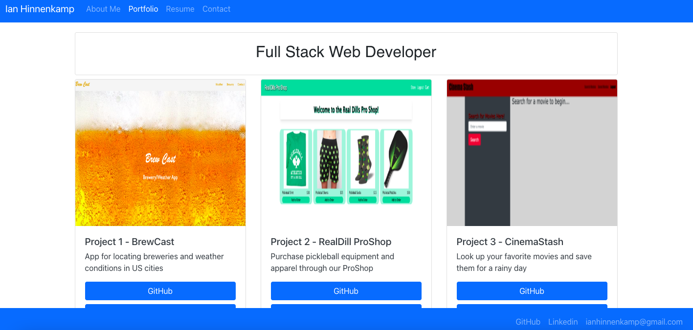

## REACT Challenge: REACT Portfolio

## 1. Description

This is a full stack web portfolio that was generated using REACT.

## 2. How to Get There

### Open your preferred web browser and enter the following web address:

http://hinnenk2.github.io/react-portfolio

## 3. Usage Tips

For local use, perform the following:

* git clone "this repo"
* npm i
* npm start
* use website http://localhost:3000

## 4. Features

### Main Page

### Portfolio

### Resume

### Contact Me

